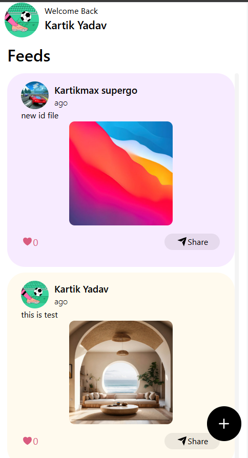
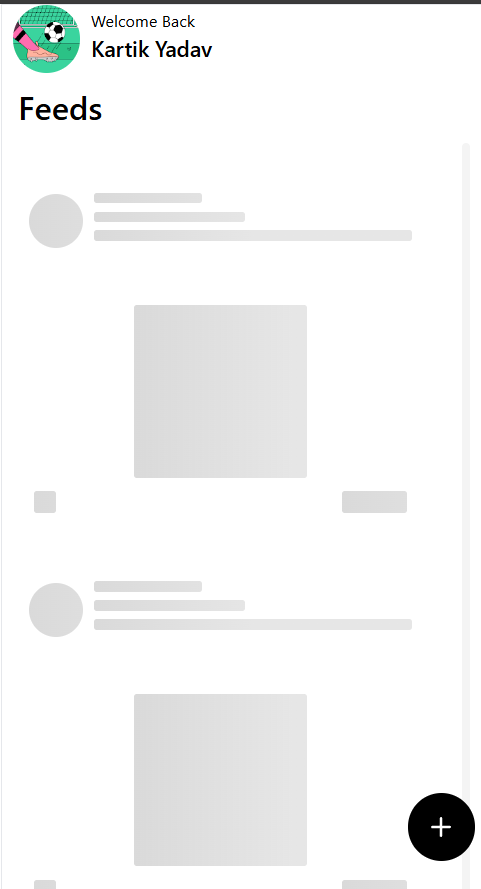
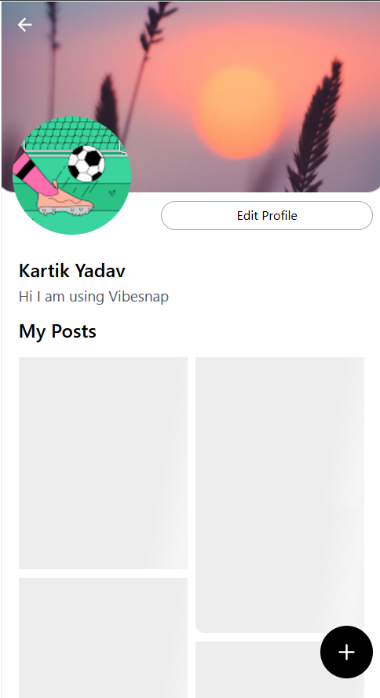
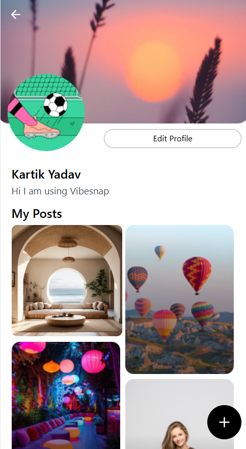

# VibeSnap

A brief social media app, for connecting people.

## Demo

https://vibesnap-nje7.vercel.app/

## Screenshots

<div style="display: flex; gap: 10px; align-items: center; flex-wrap: wrap;">
  
  
  
  
  
</div>

## Run Locally

Clone the project

```bash
  git clone https://github.com/kartikmax/vibesnap.git
```

Go to the project directory

```bash
  cd vibesnap
```

Go to firebase and create the project
and use .env.example and then create .env file

```bash
  mkdir .env
```

Install dependencies

```bash
  pnpm or npm install
```

Start the server

```bash
  pnpm or npm run dev
```